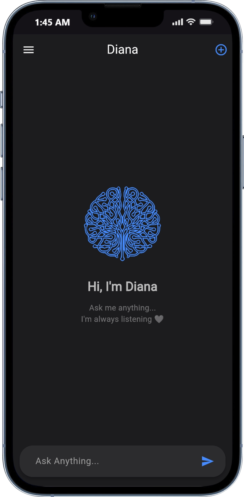
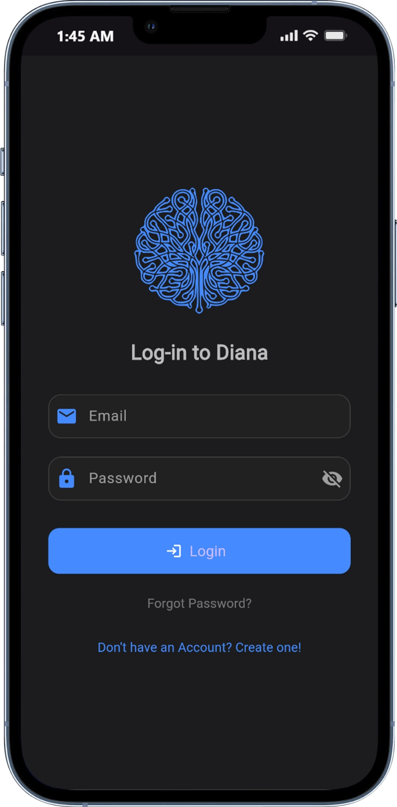
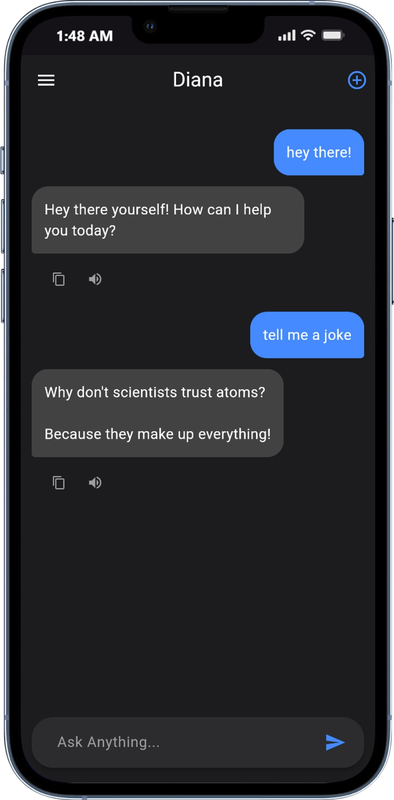

# Diana 💬

A **modern, animated, and fully functional chat app** built with **Flutter** and **Firebase**, designed for web, desktop, and mobile. Perfect for showcasing your Flutter skills in a portfolio or experimenting with authentication, animations, and state management.

---

## 🚀 Features

- ✨ **Beautiful Animations**  
  Splash screen with brain assemble animation and smooth scaling transitions.

- 🔐 **Firebase Authentication**  
  - Email/password sign-up and login
  - Forgot password support
  - Persistent login state using SharedPreferences

- 💬 **Chat Functionality**  
  - Real-time messaging using Firebase Firestore
  - User-specific chat experience
  - Clean and modern UI

- 🌐 **Flutter Web Support**  
  Fully responsive and ready to host on GitHub Pages, Vercel, or any static hosting.

- 🖤 **Dark Theme**  
  Sleek and minimalistic dark design, perfect for tech portfolios.

---

## 🎨 Screenshots

<table>
  <tr>
    <td align="center">
      <br>
      Home Screen
    </td>
    <td align="center">
      <br>
      Login Screen
    </td>
    <td align="center">
      <br>
      Chat Screen
    </td>
  </tr>
</table>

---

## ⚡ Getting Started

### 1. Clone the repo
```bash
git clone https://github.com/YOUR_USERNAME/diana.git
cd diana
```

### 2. Install dependencies
```bash
flutter pub get
```
### 3. Set up Firebase

 - Create a new Firebase project

 - Add Android, iOS, and Web apps

 - Download google-services.json (Android) and firebase_options.dart (Web/iOS) using flutterfire configure

 - Replace the files in your project

### 4. Run Locally
```bash
flutter run
```
